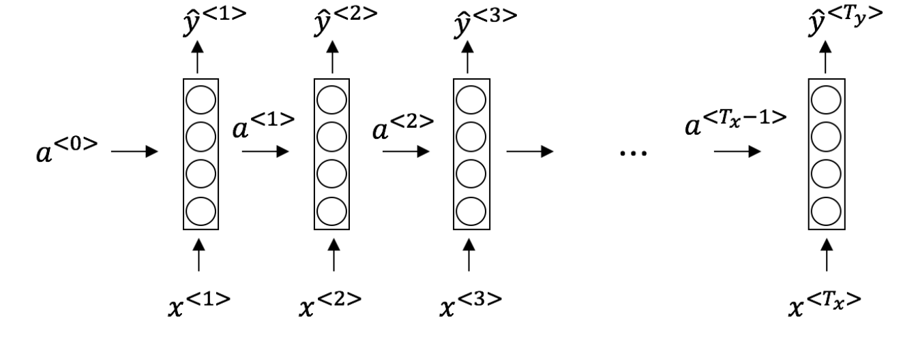
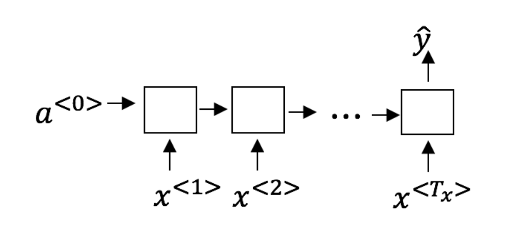
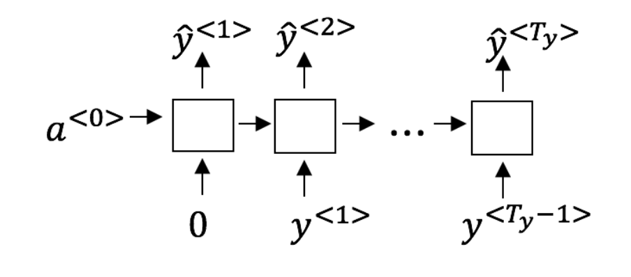

# Recurrent Neural Networks

1. Suppose your training examples are sentences (sequences of words). Which of the following refers to the jth word in the ith training example?

	- [x] x(i)\<j> 
	- [ ] x\<i>(j) 
	- [ ] x(j)\<i> 
	- [ ] x\<j>(i) 

2. Consider this RNN:

This specific type of architecture is appropriate when:  
	- [x] Tx = Ty  
	- [ ] Tx < Ty  
	- [ ] Tx > Ty  
	- [ ] Tx = 1  

3. To which of these tasks would you apply a many-to-one RNN architecture? (Check all that apply).
  
	- [ ] Speech recognition (input an audio clip and output a transcript)  
	- [x] Sentiment classification (input a piece of text and output a 0/1 to denote positive or negative sentiment)  
	- [ ] Image classification (input an image and output a label)  
	- [x] Gender recognition from speech (input an audio clip and output a label indicating the speaker’s gender)  

4. You are training this RNN language model.

At the tth time step, what is the RNN doing? Choose the best answer.  
	- [ ] Estimating P(y\<1>, y\<2>, ...., y\<t-1>)
	- [ ] [] Estimating P(y\<1>)
	- [x] Estimating P(y\<t> | y\<1>, y\<2>, ...., y\<t-1>)
	- [x] Estimating P(y\<t> | y\<1>, y\<2>, ...., y\<t>)
