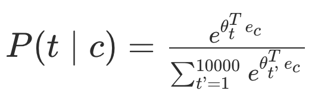

1. Suppose you learn a word embedding for a vocabulary of 10000 words. Then the embedding vectors should be 10000 dimensional, so as to capture the full range of variation and meaning in those words.

	- [ ] True
	- [x] False

2. What is t-SNE?
    - [x] A linear transformation that allows us to solve analogies on word vectors
    - [ ] A non-linear dimensionality reduction technique
    - [ ] A supervised learning algorithm for learning word embeddings
    - [ ] An open-source sequence modeling library

3. Suppose you download a pre-trained word embedding which has been trained on a huge corpus of text. You then use this word embedding to train an RNN for a language task of recognizing if someone is happy from a short snippet of text, using a small training set.

    | x (input text)  | y (happy?)  |
	| ------------- | -------------  |
	| I'm feeling wonderful today! | 1  |
	| I'm bummed my cat is ill. | 0  |
	| Really enjoying this!	 | 1  |

	Then even if the word “ecstatic” does not appear in your small training set, your RNN might reasonably be expected to recognize “I’m ecstatic” as deserving a label y=1.

	- [x] True
	- [ ] False

4. Which of these equations do you think should hold for a good word embedding? (Check all that apply)

	- [x] eboy - egirl ≈ ebrother - esister
	- [ ] eboy - egirl ≈ esister - ebrother
	- [x] eboy - ebrother ≈ egirl - esister
	- [ ] eboy - ebrother ≈ esister - egirl

5. Let EE be an embedding matrix, and let o1234 be a one-hot vector corresponding to word 1234. Then to get the embedding of word 1234, why don’t we call E * o1234 in Python?

	- [x] It is computationally wasteful.
	- [ ] The correct formula is ET* o1234.
	- [ ] This doesn’t handle unknown words (<UNK>).
	- [ ] None of the above: calling the Python snippet as described above is fine.

6. When learning word embeddings, we create an artificial task of estimating *P(target∣context)*. It is okay if we do poorly on this artificial prediction task; the more important by-product of this task is that we learn a useful set of word embeddings.
	
	- [x] True
	- [ ] False

7. In the word2vec algorithm, you estimate *P(t∣c)*, where *t* is the target word and *c* is a context word. How are *t* and *c* chosen from the training set? Pick the best answer.

	- [ ] *c* is a sequence of several words immediately before *t*.
	- [ ] *c* is the one word that comes immediately before *t*.
	- [x] *c* and *t* are chosen to be nearby words.
	- [ ] *c* is the sequence of all the words in the sentence before *t*.

8. Suppose you have a 10000 word vocabulary, and are learning 500-dimensional word embeddings. The word2vec model uses the following softmax function:
  
Which of these statements are correct? Check all that apply.

	- [x] *θt* and *ec* are both 500 dimensional vectors.
	- [ ] *θt* and *ec* are both 10000 dimensional vectors.
	- [x] *θt* and *ec* are both trained with an optimization algorithm such as Adam or gradient descent.
	- [x] After training, we should expect *θt* to be very close to *ec* when *t* and *c* are the same word.

9. Suppose you have a 10000 word vocabulary, and are learning 500-dimensional word embeddings.The GloVe model minimizes this objective:
  
Which of these statements are correct? Check all that apply.

	- [ ] *θi* and *ej* should be initialized to 0 at the beginning of training.
	- [x] *θi* and *ej* should be initialized randomly at the beginning of training.
	- [x] *Xij* is the number of times word j appears in the context of word i.
	- [x] The weighting function *f(.)* must satisfy *f(0) = 0*

10. You have trained word embeddings using a text dataset of *m1* words. You are considering using these word embeddings for a language task, for which you have a separate labeled dataset of *m2* words. Keeping in mind that using word embeddings is a form of transfer learning, under which of these circumstance would you expect the word embeddings to be helpful?

	- [x] *m1 >> m2*
	- [ ] *m1 << m2*
